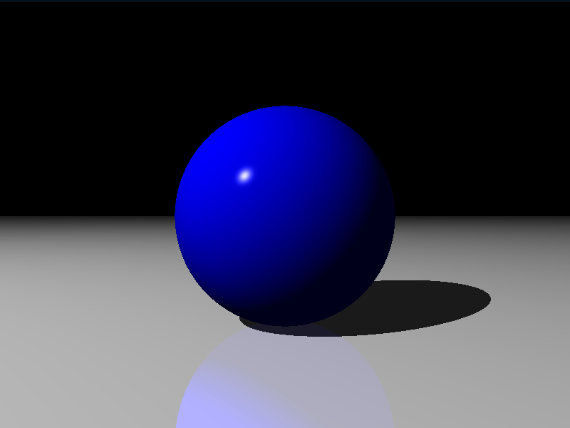

# Ray Tracer

A Ray Tracer implementation using JavaScript and Canvas.

  

## What's That?

A 3D renderer that casts rays of light around a scene. It follows their paths as they bounce around light sources to determine the final colour of each pixel.

## The Whitted Ray Tracing Algorithm

The program uses the algorithm with these steps:

1. Cast a ray into the scene and find where it strikes a surface.
2. Cast a ray from that point towards each light source to determine which lights illuminate it.
3. If the surface is reflective, cast a new ray in the direction of reflection and recursively determine the reflected colour.
4. If the surface is transparent, do the same in the direction of refraction.
5. Combine all colours that contribute to a point and return that as the colour of the pixel.

## Features

- Primitive shapes including Cubes, Spheres and Triangles.
- Material transparency, reflection and refraction.
- Material patterns such as stripes and gradients.
- Support for set operations: union, difference and intersect.
- Normal interpolation for "smooth" models created using triangles.
- A .obj file parser.

## Future Improvements

- [ ] Area lights and soft shadows.
- [ ] Spotlights
- [ ] Focal Blur
- [ ] Motion Blur
- [ ] Anti-aliasing
- [ ] Texture Maps
- [ ] Normal Perturbation
- [ ] Torus Primitives

## Acknowledgements

Inspired by [The Ray Tracer Challenge by Jamis Buck](http://raytracerchallenge.com/).
